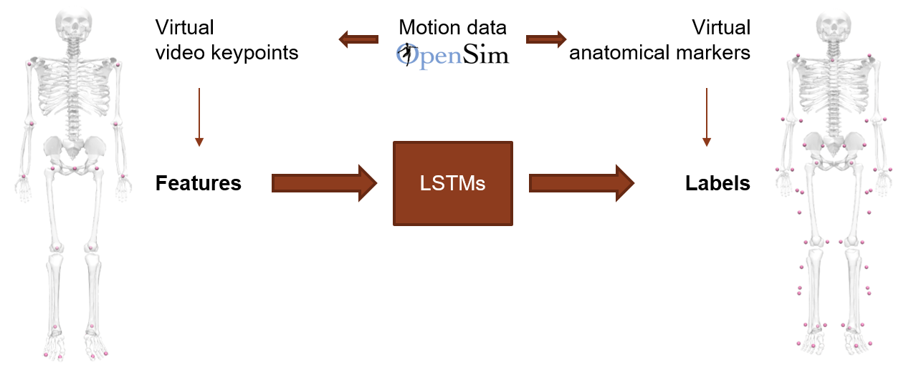

# Human body marker augmentation

This repository contains code to train a deep learning model that predicts the 3D position of anatomical markers (red dots on the skeleton on the right below) from the 3D position of video keypoints (red dots on the skeleton on the left below). The trained model was deployed as part of [OpenCap](https://www.opencap.ai/) (source code [here](https://github.com/stanfordnmbl/opencap-core)). 

The 2D position of video keypoints can be identified from videos using pose estimation models (eg, [OpenPose](https://github.com/CMU-Perceptual-Computing-Lab/openpose)). Their 3D position can then be reconstructed using triangulation if videos from multiple views are available. However, the set of markers identified from common pose estimation models is typically sparse (eg, there are no markers between the shoulders and the hips), which makes difficult the robust estimation of 3D joint kinematics (joint angles). By augmenting the video-based marker set into a more comprehensive set of anatomical markers, we address this limitation and improve the accuracy of joint kinematic estimates (by in average 3.4 deg and up to 32.6 deg). More details in [this preprint](https://www.biorxiv.org/content/10.1101/2022.07.07.499061v1) and this [conference talk](https://www.youtube.com/watch?v=fBL2YDNspP4).

To train the model, we used over 100 hours of synthetic data. The dataset was generated by processing motion capture data with [OpenSim](https://simtk.org/projects/opensim). We chose to train LSTMs as they leverage time-series data, which is the type of data we are dealing with. 

  

### Install requirements (might not be complete, in practice we used docker, see below)
1. Install [Anaconda](https://www.anaconda.com/)
2. Clone the repository to your machine.
3. Open the Anaconda command prompt and create a conda environment: `conda create -n marker-augmentation`
4. Activate the environment: `conda activate marker-augmentation`
5. Install [tensorflow with GPU support](https://www.tensorflow.org/install/pip).
6. Install other dependencies. Navigate to the local directory where the repository is cloned, then: `python -m pip install -r requirements.txt`

### Dataset
- A subset of the dataset is available [here](https://drive.google.com/file/d/1zstU911Jc9_Y692pjhk8smBwRnOh5hr1/view?usp=sharing). Download it into /marker-augmentation/Data. The dataset is split into time sequences of 30 frames; each time sequence is saved as a .npy file. The path to the first feature time sequence should be something like /marker-augmentation/Data/data_subset/feature_0.npy.

### Overview files
**Main files**:
- `trainLSTM.py`: script to train LSTM model.
- `evaluateLSTM.py`: script to evaluate LSTM model.
- `testLSTM.py`: script to test LSTM model on real-world data.
- `tuneHyperParametersLSTM.py`: script to tune hyperparameters of LSTM model.
- `myModels.py`: script describing the model architecture.
- `myModelsHyperParameters.py`: script describing the model architecture with support for hyperparameters tuning.
- `myDataGenerator.py`: script describing the data generator.
- `mySettings.py`: script with some tunable model settings.

**Other files (you should not need to interact with these files)**:
- `splitData.py`: script to split the data into different sets (training, validation, test).
- `infoDatasets.py`: some details about the dataset.
- `utilities.py`: various utilities.

### Docker
- You can also use docker. The following instructions worked for me on a machine where cuda and cudnn were installed, you should adjust the paths and names according to your working environment.
- Build image: eg `docker build -t antoine/tensorflow:latest-gpu-0.1 .`
- Train model: eg `sudo docker run --gpus all -it --rm -v /home/clarkadmin/Documents/MyRepositories/marker-augmentation:/marker-augmentation antoine/tensorflow:latest-gpu-0.1 python augmenter-cs230/trainLSTM.py`
- Evaluate model: eg `sudo docker run --gpus all -it --rm -v /home/clarkadmin/Documents/MyRepositories/marker-augmentation:/marker-augmentation antoine/tensorflow:latest-gpu-0.1 python marker-augmentation/evaluateLSTM.py`
- Test model: eg `sudo docker run --gpus all -it --rm -v /home/clarkadmin/Documents/MyRepositories/marker-augmentation:/marker-augmentation antoine/tensorflow:latest-gpu-0.1 python marker-augmentation/testLSTM.py`
- Tune hyperparameters: eg `sudo docker run --gpus all -it --rm -v /home/clarkadmin/Documents/MyRepositories/marker-augmentation:/marker-augmentation antoine/tensorflow:latest-gpu-0.1 python marker-augmentation/tuneHyperParametersLSTM.py`
- The files might be locked after training, to unlock run `sudo chown -R $USER: $HOME`
